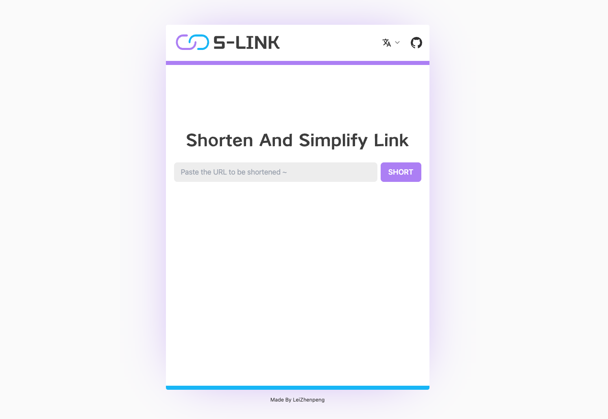

<p align='center'>
  
</p>

<p align='center'>
缩短网址，让分享更简单
<br>
 Shorten Link, Make Sharing Simpler
</p>

<br>

<p align='center'>
<a href="https://ss-link.netlify.app/">Live Demo</a>
</p>

<br>

<p align='center'>
<b>English</b> | <a href="https://github.com/Leizhenpeng/link-shorter/blob/master/readme.md">简体中文</a>
<!-- Contributors: Thanks for getting interested, however we DON'T accept new transitions to the README, thanks. -->
</p>

<br>

## Features

- ⚡️ [qwik](https://qwik.builder.io/) Accelerate our SSR application from the source

- 📦 [iris](https://www.iris-go.com/) A High Performance, Easy to Use and Powerful Go Language Web Framework

- 🔎 [bolt](https://github.com/boltdb/bolt) An efficient, embedded, and persistent key-value storage database, just don't want to use too heavy mysql and redis

- 🎨 [TaliWindCss](https://tailwindcss.com/) The Patriarch of the Atomic CSS Framework

- 😃 [daisyui](https://daisyui.com/) Use Tailwind CSS but write less class names


- ☁️ Deploy on Netlify, zero-config

- 🦾 Golang, of course

- 🦾 TypeScript, of course

<br>

## Function introduction - qwik part

- Global variable management

- [I18n](https://robisim74.gitbook.io/qwik-speak/) multi-language switching

## Function introduction - iris part

### Record the request log and write it to a local file

```json
{
  "timestamp": "2023-01-21 21:15:03",
  "latency": 405000,
  "code": 200,
  "method": "GET",
  "path": "/ping",
  "ip": "::1",
  "bytes_sent": 4
}

```


### Management side JWT identity verification

```go
app.Post("/login", s.Login)
admin := app.Party("/admin")
{
    admin.UseRouter(jwtMiddle.Serve)
    admin.Post("/flush", s.Flush)
    admin.Get("/all", s.All)
    admin.Post("/del", s.DelOne)
}
```

### Routing self-test, become a cute backend
```go
var commonSchema = `{
			"type": "object",
			"properties": {
				"code":  {"type": "number"},
				"msg":   {"type": "string"},
				"data":  {"type": ["object","string"]}},
			"required": ["code", "msg", "data"]
		}`
    
func TestAdminApi(t *testing.T) {
	app := NewApp()
	e := httptest.New(t, app)
	e.GET("/admin/all").Expect().Status(httptest.StatusOK).
		JSON().Schema(commonSchema)
}
```


## Relevant information

### golang

- [iris-cors](https://docs.iris-go.com/iris/security/cors#the-cors-configuration)
- [iris-jwt](https://github.com/iris-contrib/middleware/tree/master/jwt)
- [iris-test](https://docs.iris-go.com/iris/contents/testing)

### qwik

- [vite-env](https://cn.vitejs.dev/guide/env-and-mode.html#env-files)
- [qwik-i18n-by-speak](https://github.com/robisim74/qwik-speak)
- [qwik-init-repo](https://qwik.builder.io/docs/getting-started/)
- [qwik-state-management](https://qwik.builder.io/docs/components/state/)
- [qwik-component](https://qwik.builder.io/docs/components/overview/)
- [qwik-lite-component](https://qwik.builder.io/docs/components/lite-components/)
- [svg-to-jsx](https://www.svgviewer.dev/svg-to-react-jsx)


